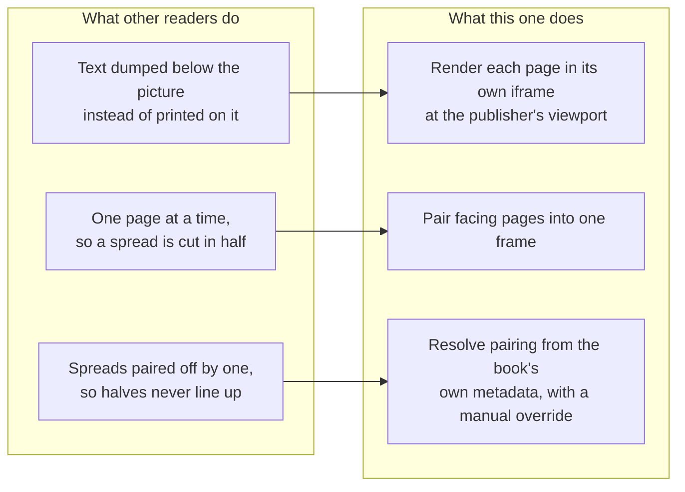
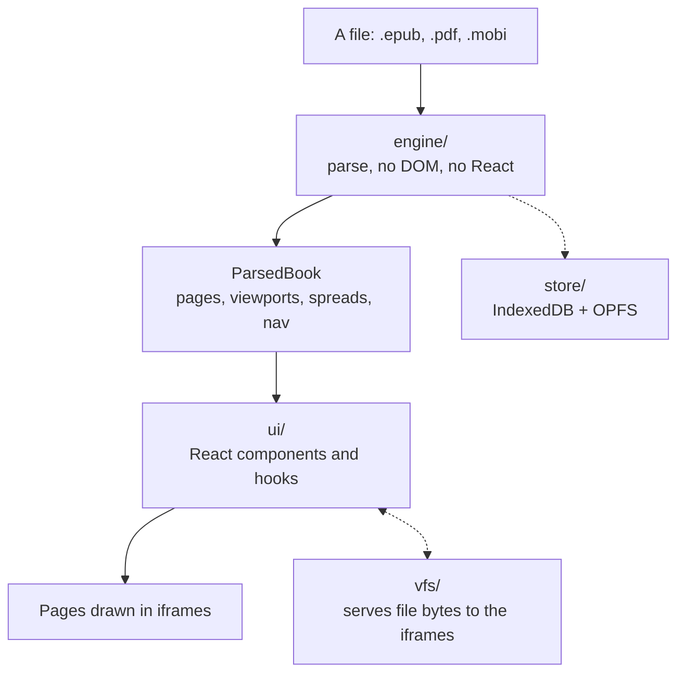

# Developer documentation

Start here if you have just cloned the repo.

These pages explain **how the reader works and why it is built this way**. They are
written to be read in order, but each one stands alone. Every page has collapsed
**Advanced** sections: skip them the first time through — they are the details that
matter once you are changing the code rather than reading it.

| Page | What it covers |
|---|---|
| [Architecture](architecture.md) | The layers, what depends on what, and what runs where |
| [Opening a book](opening-a-book.md) | The whole journey from a tapped file to a drawn page |
| [Fixed layout and spreads](fixed-layout.md) | The problem this project exists to solve |
| [Read-along](read-along.md) | Narration, word highlighting, and turning the page mid-sentence |
| [Storage and offline](storage-and-offline.md) | Where books live, and what happens when that fails |

Also in this folder: [device-test.md](device-test.md) for checking a build on real
hardware, and [release.md](release.md) for cutting a version.

The [SPEC](../SPEC.md) is the contract — what the reader promises, what is built, and
what is deliberately missing. When these docs and the SPEC disagree, the SPEC is the
one to trust, and the disagreement is a bug in these docs.

## Why this reader exists

Three failures, seen in every Android EPUB reader tried before starting. The whole
design follows from them.



A children's picture book is **fixed layout**: the publisher positions every word on
the illustration. Most readers push those books through their reflowable pipeline,
throw away the stylesheet, and the words land in a heap under the picture. See
[Fixed layout and spreads](fixed-layout.md).

## The 60-second tour



- **`src/engine/`** turns bytes into a `ParsedBook`. No React, no DOM — it is all
  pure functions over `Uint8Array`, which is why it is the easiest part to test.
- **`src/ui/`** is React. It decides what is on screen and handles gestures.
- **`src/vfs/`** lets a page inside an iframe load its own images and CSS, out of a
  zip file that only exists in memory.
- **`src/store/`** keeps books, positions and bookmarks on the device.
- **`src/reader/`** is the logic that is neither parsing nor rendering: the
  read-along player, text anchors, typography.

## Running it

```bash
npm install && npm run dev
```

Put books in `corpus/local/` — gitignored, because real picture books are in
copyright — and they appear on the library screen under **Development corpus**. The
synthetic books in `corpus/fixtures/` are committed and are what the tests use.

```bash
npm test          # unit tests, ~100 of them, sub-second
npm run typecheck # tsc only; emits nothing
npm run build     # production bundle
npm run fixtures  # regenerate corpus/fixtures
```

<details>
<summary><b>Advanced:</b> why the engine has no framework, and what that buys</summary>

The engine is deliberately free of React, the DOM and any bundler magic. Three
reasons, in order of how much they have paid off:

1. **Tests run without a DOM.** `npm test` is vitest with no jsdom dependency, and
   the whole suite finishes in well under a second. Parsing an EPUB, deciding a
   layout and pairing spreads are all exercised against real zip bytes.
2. **The hard parts stay honest.** Spread pairing is a pure function from page
   metadata to sides. If it needed a rendered document it could only be tested by
   screenshot, which is exactly how this class of bug survives in other readers.
3. **It could move.** Nothing in `engine/` knows it is in a browser tab. A CLI that
   dumps a book's pairing decisions, or a Node-side pre-processor, needs no changes.

The cost is that anything needing measurement — how many screens a reflowable
section takes, which screen an element falls on — cannot live there. That logic is
in `src/reader/` and `src/ui/` instead, and the seam is *"does this need a laid-out
document?"* If yes, it is not engine code.

One consequence worth knowing: `engine/` may not import from `ui/`, `store/` or
`vfs/`. The dependency arrow only ever points inward.
</details>
