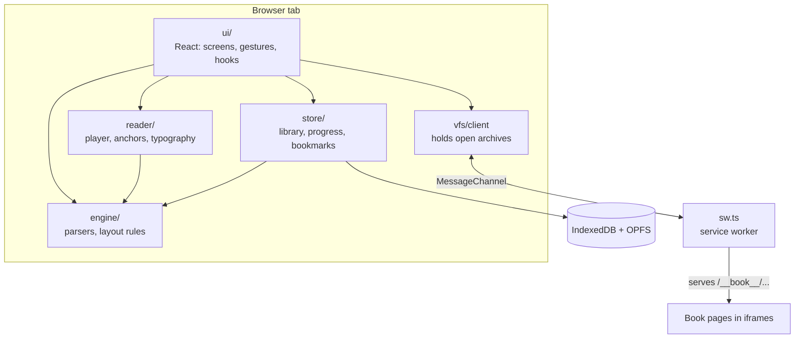
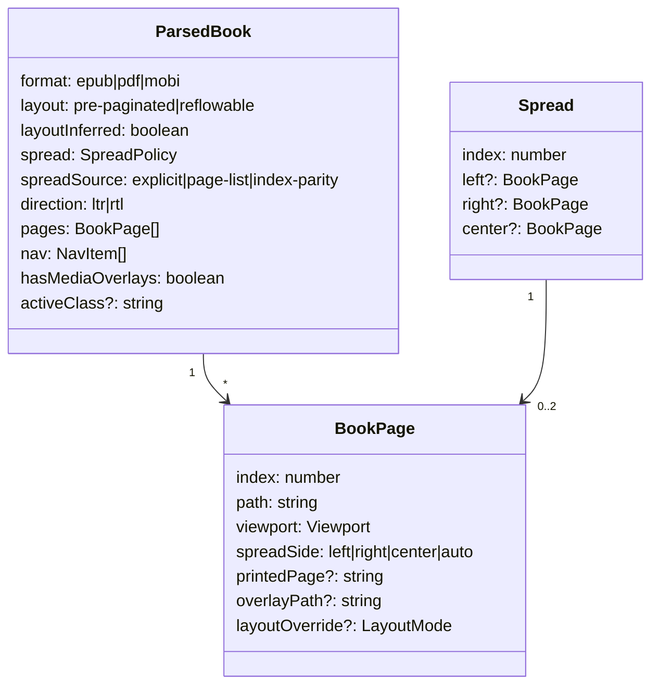
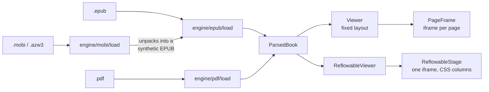
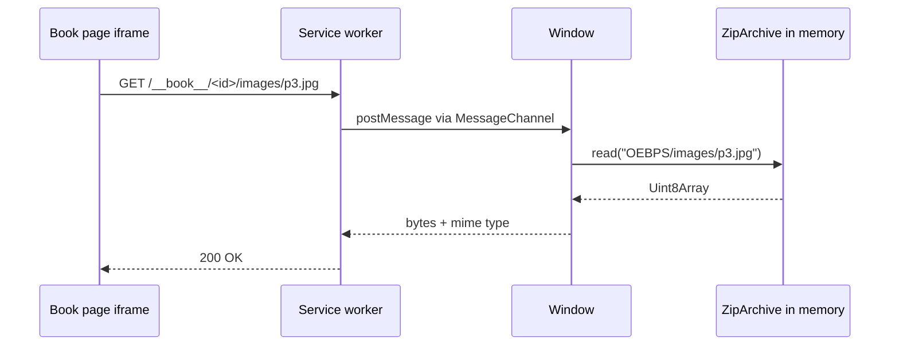
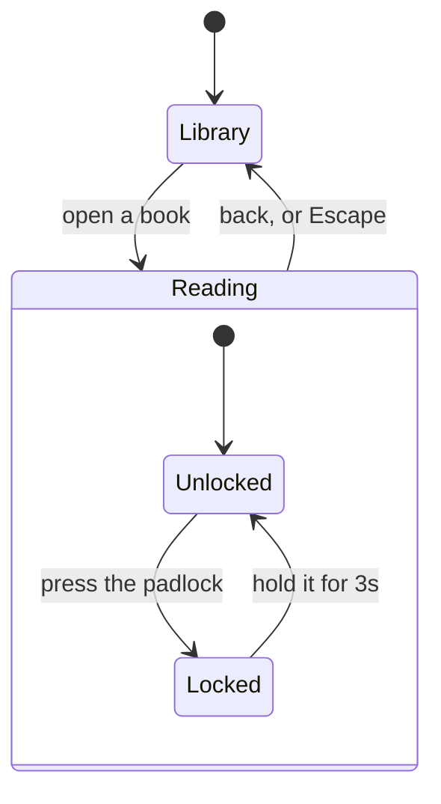

# Architecture

How the pieces fit, and which rules about them are worth keeping.

## The layers



Read the arrows as *"is allowed to import from"*. There is one rule: **`engine/`
imports from nothing else in `src/`**. Everything else may depend on it. Keeping that
one arrow one-way is what makes the engine testable without a browser.

## What each folder is for

| Folder | Responsibility | Depends on a DOM? |
|---|---|---|
| `engine/` | Bytes → `ParsedBook`. Zip, XML, OPF, nav, SMIL, layout rules, MOBI, PDF | No |
| `reader/` | Logic needing a laid-out document: read-along player, text anchors, typography | Yes |
| `ui/` | React screens, gestures, keyboard, hooks | Yes |
| `store/` | Persistence: library, reading positions, overrides, bookmarks | No, but async |
| `vfs/` | Serving book files to iframes | Yes |
| `native/` | Android intents — files handed over by the system | Capacitor |

<details>
<summary><b>Advanced:</b> the seam between <code>engine/</code> and <code>reader/</code></summary>

The test is *"can this be decided from the file alone?"*

`engine/layout/spread.ts` decides which page is a left and which is a right. That is
a function of spine properties, the nav `page-list` and page viewports — all in the
file — so it is engine code, and `spread.test.ts` covers fourteen cases without
rendering anything.

`reader/anchor.ts` answers "which screen is this paragraph on?" That cannot be known
without a laid-out document: it depends on the current type size, the frame width and
how the columns broke. So it takes a live `Document` and reads geometry off it.

The rule matters because the temptation always runs one way — a layout question
looks answerable from metadata right up until it isn't. If a function needs
`getBoundingClientRect`, it does not belong in `engine/`.
</details>

## The data model

Everything the UI renders comes from one object.



Two things to notice, because they explain a lot of the code:

- **`pages` is flat; `Spread` is derived.** Pairing is recomputed whenever the frame
  changes shape — rotate a tablet and a book that showed spreads shows single pages.
  Nothing is stored pre-paired.
- **`spreadSource` is kept, not just used.** The reader shows *how* it decided the
  pairing, so a wrong guess is explainable rather than mysterious. See
  [Fixed layout and spreads](fixed-layout.md).

## Three formats, one viewer



MOBI does not get its own viewer. `engine/mobi/load.ts` unpacks the PalmDB records,
decompresses the text and **builds an EPUB in memory** — container, OPF, nav
document, the lot — then hands it to the EPUB loader. Everything downstream, library
included, only ever sees an EPUB.

<details>
<summary><b>Advanced:</b> why MOBI is transcoded rather than rendered directly</summary>

A MOBI is an HTML document split across PalmDOC records, with a proprietary index
for navigation. Rendering it directly would mean a second pagination path, a second
navigation model and a second set of bugs, for a format that is effectively frozen.

Synthesising an EPUB means the reflowable viewer, the nav, bookmarks, resume and the
virtual filesystem all work unchanged — the table of contents in the reader's menu
works for MOBI because `load.ts` writes a `nav.xhtml` while unpacking.

The one thing not implemented is **HUFF/CDIC compression** (type 17480). It is
detected and refused with an explanation rather than rendered as noise. Uncompressed
and PalmDOC-compressed books work, which covers all KF8/AZW3. Implementing HUFF/CDIC
without a sample file to verify against would have meant shipping bit-twiddling
nobody could check — see SPEC.md §13.
</details>

## What runs where

This is the part that surprises people: **book pages run in iframes**, and those
iframes fetch their own images and stylesheets over HTTP from a service worker that
reads a zip file held in the page's memory.



The alternative — rewriting every `src` and `href` in the page to a blob URL — breaks
relative paths, CSS `url()` references and anything the publisher's own script does.
Serving real URLs means the publisher's document works untouched, which is the entire
promise of the app. [Storage and offline](storage-and-offline.md) covers the fallback
for when there is no service worker.

<details>
<summary><b>Advanced:</b> the service worker's constraints</summary>

- **It must be a classic script, not an ES module.** It is registered classically, so
  the Vite PWA plugin is configured with `rollupFormat: 'iife'`. A module-format
  worker registered classically fails at parse time with an error that does not
  obviously point at the format.
- **It holds no book data.** The zip lives in the window, not the worker: a worker
  can be killed and restarted at any time, and re-reading a 40MB archive on every
  restart would be both slow and pointless. The worker is a router, and if no window
  is holding the book it answers with an error rather than guessing.
- **Audio does not go through it.** Media elements issue byte-range requests
  constantly, and answering each one with a round trip through `postMessage` is
  needlessly slow. Audio is handed to a blob URL instead — see
  [Read-along](read-along.md).
- **Updates wait.** A new deployment means a new worker and a reload to pick up new
  assets. Reloading mid-story would drop a child out of their book, so the reload is
  deferred until they are back at the library — `setReading()` in `vfs/client.ts`.
</details>

## State that lives in React



`App.tsx` owns exactly one important piece of state: the `session`, meaning *which
book is open*. Everything else — which page, which screen, zoom, whether the bars are
showing — belongs to the viewer and dies with it. Reading position is written out to
storage as it changes, so it survives the component being unmounted.

<details>
<summary><b>Advanced:</b> one source of truth for position, and a bug that taught us</summary>

In a fixed-layout book the reader tracks **`pageIndex`**, and the spread index is
derived from it:

```ts
const spreadIndex = useMemo(
  () => spreads.findIndex((s) =>
    s.center?.index === pageIndex || s.left?.index === pageIndex || s.right?.index === pageIndex),
  [spreads, pageIndex],
)
```

It was briefly the other way around — spread index as state, page index derived —
and resume broke. Two effects wrote to a shared ref, React's StrictMode invoked them
twice in development, and a book reopened at page 12 snapped back to page 1.

Deriving is not just tidier here, it is *correct*: pairing changes when the device
rotates, so a stored spread index means a different place afterwards. A page index
means the same page whatever shape the frame is. The same reasoning drives text
anchors for reflowable books — see [Read-along](read-along.md) and `reader/anchor.ts`.
</details>

## Where to make a change

| You want to… | Start in |
|---|---|
| Support another format | `engine/format.ts` to detect it, then a loader beside `engine/epub/` |
| Change how spreads pair | `engine/layout/spread.ts`, and add a case to `spread.test.ts` |
| Change what a tap does | `ui/usePageGestures.ts` |
| Change the reader's menu | `ui/Viewer.tsx` and `ui/ReflowableViewer.tsx` — both have one |
| Add something to the toolbar | Both viewers again, plus `ui/styles.css` |
| Change what is stored | `store/idb.ts`, and bump the database version |

Two viewers means toolbar changes land twice. They share the toolbar and the menu
and almost nothing else: one positions whole pages in iframes at fixed viewports,
the other paginates a single document into CSS columns and re-measures it whenever
the type size changes. If you change one, check the other — the auto-hide hook and
the contents section are both wired into each separately.
