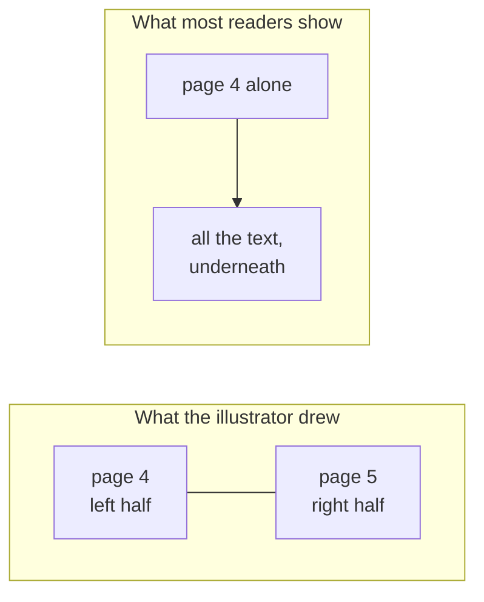
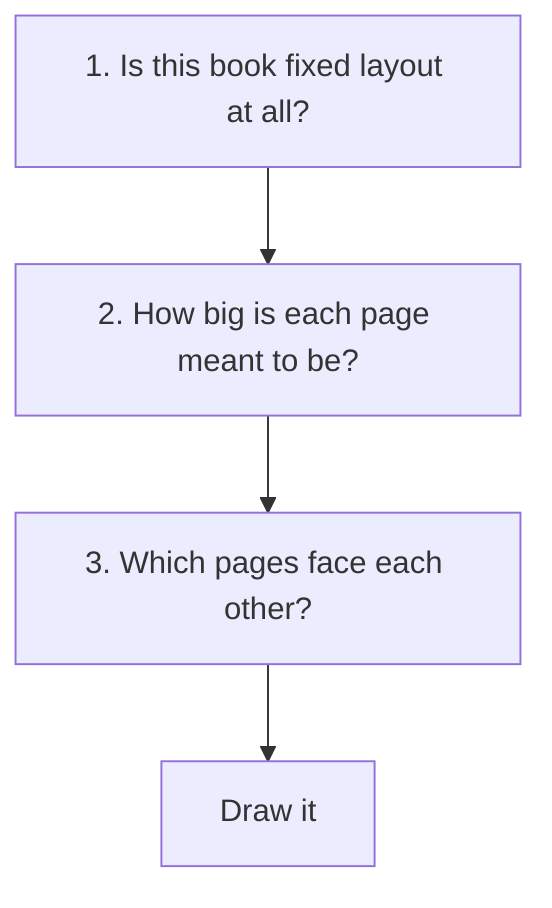
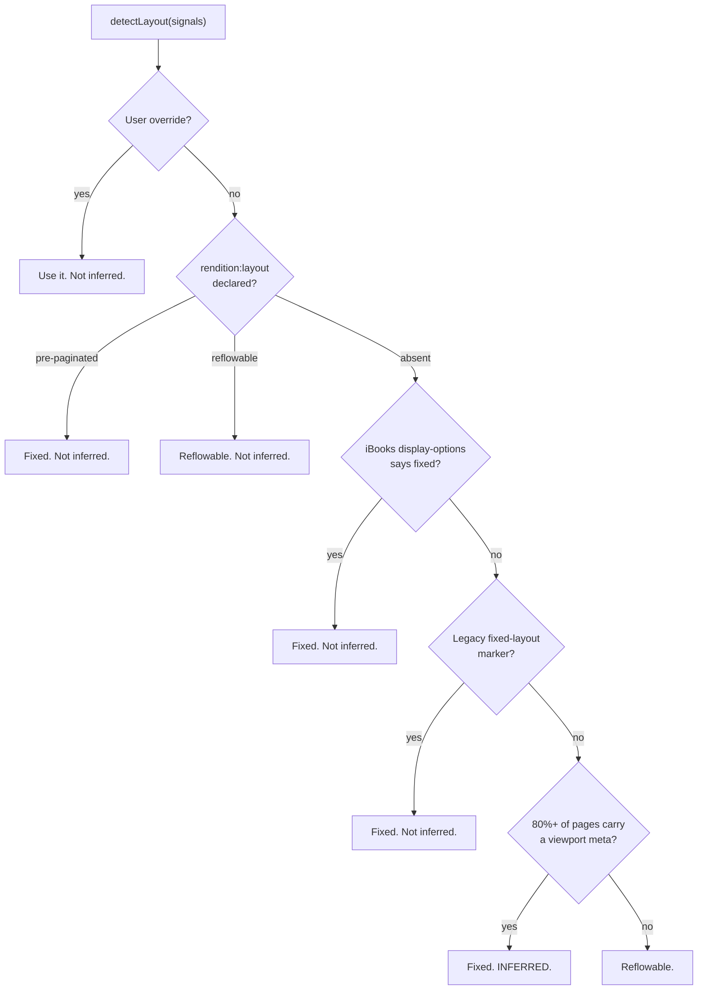
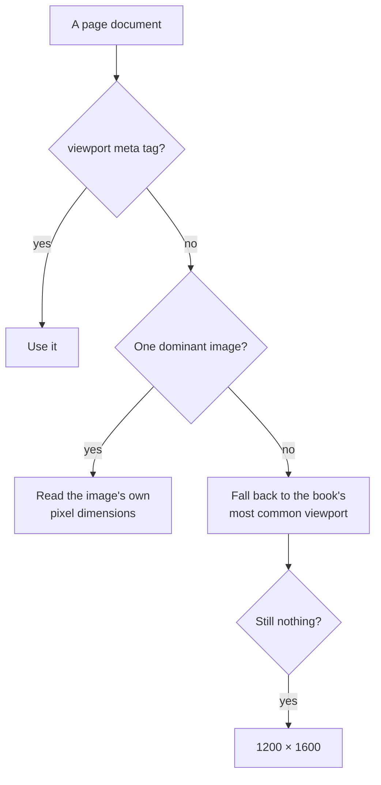
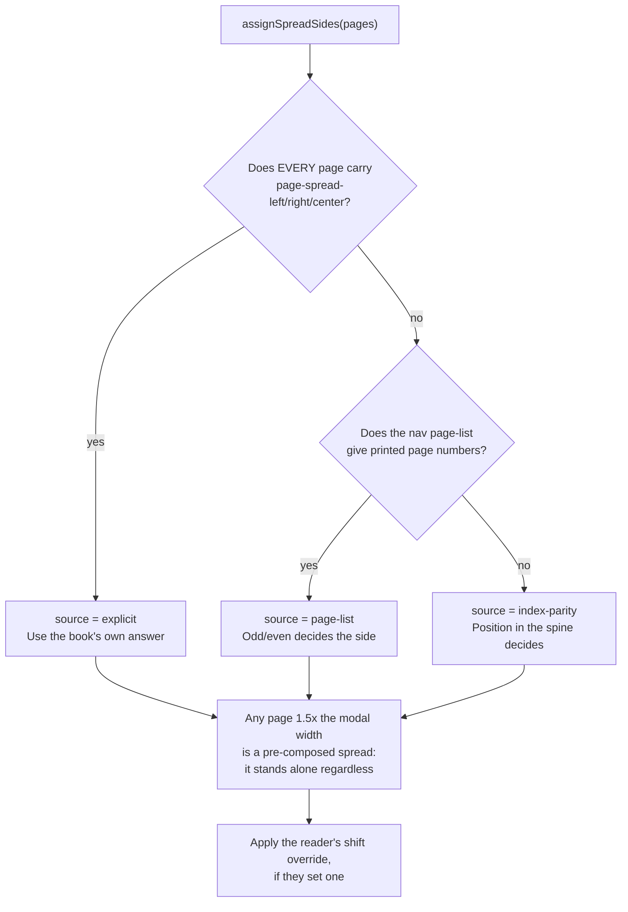
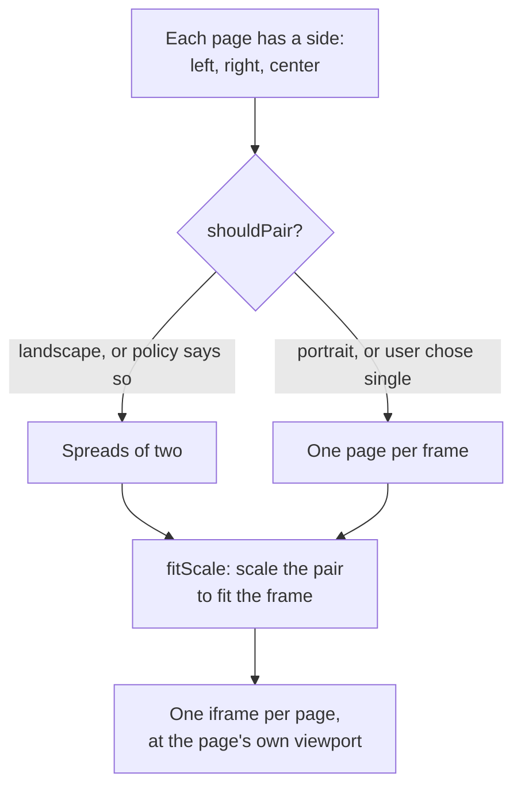

# Fixed layout and spreads

This is the heart of the project. Everything else is a reader; this is the part that
other readers get wrong.

## The problem, in one picture

A picture book is drawn as a **spread**: two facing pages that form one image, with
the words placed on the illustration.



Two separate failures are happening there:

1. The publisher's positioning is thrown away, so text that sat on the picture falls
   below it.
2. The two halves are never shown together, or are shown paired with the wrong
   neighbour, so the picture never lines up.

Solving this needs three questions answered, in order.



## 1. Is this book fixed layout?

`engine/layout/detect.ts`, and it is a waterfall — the first rule that matches wins.



The order is: what the reader said, then what the book declared, then vendor
metadata, then evidence.

That last rule is the interesting one. A book with no `rendition:layout` but where
almost every page carries `<meta name="viewport" content="width=800, height=1200">`
is a fixed-layout book whose publisher forgot to say so — common in older files. The
threshold is 80% (`VIEWPORT_COVERAGE_THRESHOLD`), not 100%, because a stray
copyright page without a viewport should not flip the verdict.

**`inferred` is carried forward into the UI.** A guessed layout is shown as a guess,
with a one-tap way to override it, because the guess is occasionally wrong and a
reader who cannot see it was a guess has no way to understand what went wrong.

<details>
<summary><b>Advanced:</b> per-page overrides and mixed books</summary>

Layout is not always one answer for a whole book. A spine `itemref` may carry
`rendition:layout-reflowable` or `rendition:layout-pre-paginated` in its
`properties`, overriding the book-level setting for that document alone —
`layoutFromSpineProperties()` reads it into `BookPage.layoutOverride`.

Real books do this: a fixed-layout picture book with a reflowable copyright page at
the back, or a reflowable novel with a fixed map plate. The reader honours the
per-page value where it exists.

The ordering in `detectLayout` matters for a subtler reason than precedence. Every
branch except the coverage rule returns `inferred: false` — including the user's own
override, which is *not* a guess and should not be labelled as one. The only path
that sets `inferred: true` is the one where nothing in the book said anything and the
decision came from counting viewports.
</details>

## 2. How big is each page?

A fixed-layout page has an intrinsic size, and the reader has to find it.



Most fixed-layout pages declare `<meta name="viewport" content="width=800,
height=1200">`. When one does not, the reader opens the page's main image and reads
its pixel dimensions out of the file header — `imageSize()` parses JPEG, PNG, GIF
and WebP headers directly, without decoding the image.

The **modal viewport** — the most common size across the book — is both the last
fallback and, separately, the thing that identifies a *pre-composed spread*: one
image already containing both halves. The test is `viewport.width >= modal.width *
1.5` (`WIDE_PAGE_RATIO`), not a strict doubling, because such pages are often a
little narrower than two pages once margins are trimmed. A page that wide fills the
frame alone and can never be paired.

<details>
<summary><b>Advanced:</b> why the modal viewport rather than the first or the largest</summary>

The first page is usually the cover, which is frequently a different shape from the
body — often taller, sometimes square. Taking it as the book's size makes every other
page slightly wrong.

The largest is worse: a single pre-composed spread page would define the book's size
as roughly twice what it should be, and then *every* normal page would look
half-width, which is precisely the signal used to detect pre-composed spreads. The
detector would eat itself.

The mode is robust to both. It is what the book mostly is, which is what "this page
is unusually wide" has to be measured against.
</details>

## 3. Which pages face each other?

This is the off-by-one that plagues other readers, and the answer is a waterfall
again — best evidence first.



Why three rules rather than one:

- **Explicit** properties are the book telling you directly. Trusted when *every*
  page has one — a book that labels half its pages is not reliably labelled, and
  mixing a declared side with a guessed one produces worse results than guessing
  consistently.
- **The page-list** maps each document to its printed page number. If a document is
  printed page 7, it is a right-hand page in a left-to-right book, because that is
  how physical books work. This recovers the correct pairing for books whose spine
  carries no hints at all.
- **Index parity** is position in the spine. It is right whenever the book starts
  where you would expect and has no front matter surprises, and wrong otherwise —
  which is exactly why the shift override exists.

<details>
<summary><b>Advanced:</b> why a manual shift exists at all</summary>

Every rule above can be defeated by a book. A page-list can be present but count
front matter the printed edition did not. Index parity assumes the first spine item
is a right-hand page, which is wrong for any book that opens on a full-bleed spread.
There is no metadata that settles it, and no heuristic that is right every time.

So `spreadShift` flips the phase of every pair at once, exposed in the reader's menu
as **Shift spread pairing**. One tap, no configuration, and it is stored per book in
the overrides store so a book only has to be corrected once.

This is a deliberate design position, not a shortcut: *guess well, show the guess,
make it one tap to fix.* The alternative — guessing harder, invisibly — is what
produces readers where a mispaired book simply cannot be fixed by the person holding
it. `spreadSource` is surfaced in the UI for the same reason.

RTL books flip the whole question: in a right-to-left book an odd printed page is a
*left*-hand page, and the reader turns the other way. `direction` comes from the
spine's `page-progression-direction` and is threaded through pairing and turning
alike.
</details>

## Pairing, then drawing

Sides are a property of the book. Whether to *use* them is a property of the screen.



`shouldPair()` answers with the rendition spread policy and the frame's shape:

| Policy | Pairs when |
|---|---|
| `none` | never |
| `portrait` | the frame is portrait |
| `landscape`, `auto` | the frame is landscape |
| `both` | always |

The reader's menu can force `single` or `double` regardless.

Because pairing depends on the frame, **rotating a tablet re-pairs the book**. This
is why nothing stores a spread index: the same spread index means a different place
after a rotation, while a page index does not.

<details>
<summary><b>Advanced:</b> no minimum width gate, and why</summary>

An obvious-looking refinement is to require a minimum per-page width before pairing:
if each half would be under, say, 400 CSS pixels, show one page instead, on the
grounds that the text would be too small.

It was specified and then deliberately dropped — SPEC.md §16.4. Two reasons. It makes
the pairing decision depend on the device's pixel ratio, so the same book pairs on
one tablet and not on another of the same physical size. And for a picture book the
*image* is the content: a spread shown as two small halves is still the picture the
illustrator drew, while the same spread split across two screens is not. Landscape
pairs, full stop, and the reader can force single if they disagree.
</details>

## Seeing it go wrong

The synthetic fixtures in `corpus/fixtures/` exist to make each rule fail visibly.
Every fixed-layout fixture draws **a white circle straddling the gutter**, so a
mispaired spread is obvious at a glance rather than something you have to reason
about.

| Fixture | What it exercises |
|---|---|
| `fxl-explicit-spreads` | Every page labelled — the explicit path |
| `fxl-no-page-list` | No page-list, so pairing falls to index parity |
| `fxl-no-spread-hints` | No properties at all, recovered from the page-list |
| `fxl-rtl` | Right-to-left progression |
| `fxl-mixed-spread-page` | A double-width page mid-book, which must stand alone |
| `narrated-spreads` | Media overlays across a page turn |

```bash
npm run fixtures   # regenerate them
npm test           # spread.test.ts covers the rules; fixtures.test.ts the books
```

Regenerating rewrites every fixture because the zip records a modification time.
Only commit the ones whose *contents* changed — see `corpus/README.md`.
