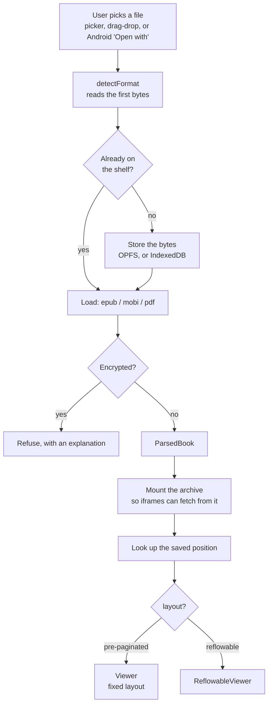
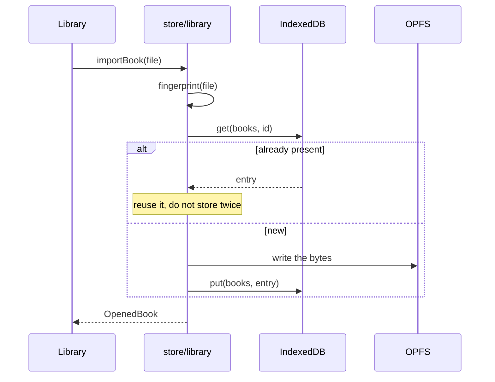
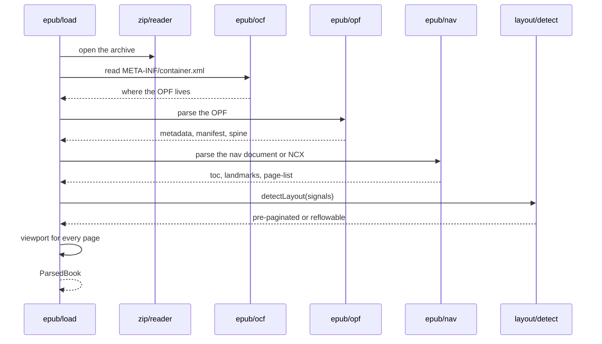
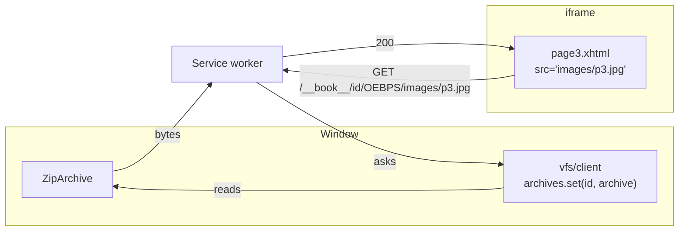
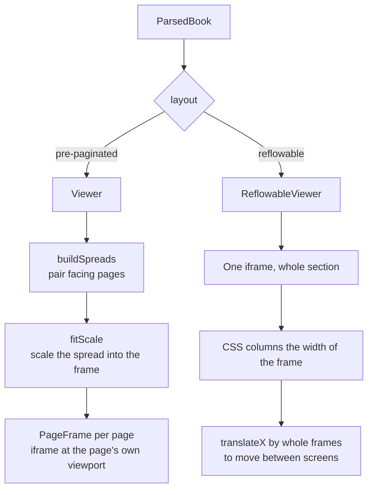
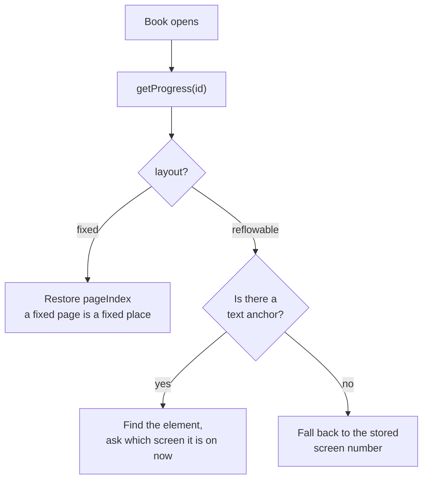

# Opening a book

Follow one file all the way from a tap to a drawn page. If you only read one of
these pages, read this one — most bugs live somewhere on this path.

## The whole journey



## Step 1: what kind of file is this?

Not by extension — by content. `engine/format.ts` reads the first few bytes:

| Signature | Format |
|---|---|
| `%PDF` at offset 0 | PDF |
| `PK\x03\x04` at offset 0 | EPUB — any zip, so the loader is what confirms it |
| `BOOKMOBI` or `TEXtREAd` at offset 60 | MOBI / AZW3 |

Order matters: PDF is checked first, then zip, then PalmDB. An AZW3 is still a
`BOOKMOBI` container — the KF8 part lives in a later record, so it sniffs the same.

An `.epub` that is secretly a zip of images is not an EPUB, and a file a file
manager labelled `application/octet-stream` may well be. Sniffing means "Open with"
works from file managers that report nothing useful, which on Android is most of
them.

## Step 2: is it already here?



The identity of a book is a **fingerprint of its bytes**, not its filename. Adding
the same book twice — once from Downloads, once from the share sheet — gives one
shelf entry, and reopening it finds the position you left.

<details>
<summary><b>Advanced:</b> what the fingerprint is, and what it costs</summary>

`fingerprint()` in `store/library.ts` hashes the file content, so identity survives
renaming and is stable across devices. The trade is that it must read the bytes
before it can answer, which on a 60MB illustrated book is not instant — it happens
once, at import, not on every open.

The consequence worth knowing: **two different files are two books, even if they are
the same story.** A re-download that differs by one byte of metadata is a new entry
with its own position and bookmarks. That is the right default for a reader that
never talks to a server — there is no edition identity to consult, and silently
merging two files because their titles match would lose someone's place.
</details>

## Step 3: parse it

This is where a pile of bytes becomes a book. For EPUB:



An EPUB is a zip with a fixed shape:

```
mimetype                 must be first, uncompressed
META-INF/container.xml   points at the OPF
OEBPS/package.opf        metadata, manifest (every file), spine (reading order)
OEBPS/nav.xhtml          table of contents, and the page-list
OEBPS/page1.xhtml        the pages themselves
```

The **spine** is reading order. The **manifest** is every file with its media type.
The **nav document** is the table of contents plus, importantly here, the
`page-list`, which maps documents to printed page numbers — that is what recovers
spread pairing for books whose spine says nothing. See
[Fixed layout and spreads](fixed-layout.md).

<details>
<summary><b>Advanced:</b> DRM, and why "encrypted" is not one question</summary>

`detectDrm()` in `engine/epub/ocf.ts` runs before anything is rendered, and it is
deliberately more careful than "is there an encryption.xml?".

Two files are refused outright, because they only ever mean DRM:
`META-INF/rights.xml` (Adobe ADEPT) and `META-INF/license.lcpl` (Readium LCP).

`META-INF/encryption.xml` is the interesting one, because it is also used for
**font obfuscation** — an IDPF scheme that scrambles the start of a font so it
cannot be lifted out of the book. That is not DRM and the book is perfectly
readable. So the check looks at what is actually encrypted:

- if every `CipherReference` points at a font file, it is obfuscation → allow;
- if every `EncryptionMethod` algorithm is an obfuscation one (`embedding`,
  `idpf`, `adobe.com/apsfont`), likewise → allow;
- anything else → refuse.

A separate trap is worth knowing because it cost a real book. *Tippie and the Cat*
carries an `Adept.expected.resource` marker inside **every XHTML document**, left
behind by Adobe's tooling, while having no `rights.xml` and no `encryption.xml` at
all. Nothing in it is encrypted. Keying on the inline marker rather than on the
container files would refuse a readable book, and `load.test.ts` pins that.

The reader never attempts to decrypt anything. Refusing with a clear message is the
whole policy — SPEC.md §12.
</details>

## Step 4: mount it, so the pages can load themselves

A fixed-layout page is a real XHTML document with `` and a
stylesheet. For that to work, those URLs have to resolve — but the files only exist
inside a zip in memory.



`mountBook(id, archive)` is what makes a book fetchable. Forget it and the pages
render as broken images with no obvious cause — the network tab shows 404s from a
worker you did not know was involved.

<details>
<summary><b>Advanced:</b> when there is no service worker</summary>

Private windows, a blocked registration, or plain `file://` all mean no worker. The
reader does not give up: `vfs/inline.ts` provides an `InlinePageResolver` that reads
the page's XHTML, rewrites its references to blob URLs, and renders it through the
iframe's `srcdoc`.

The subtlety is **same-origin**. A `srcdoc` iframe inherits the parent's origin,
which matters because read-along reaches into the page's document to highlight
words, and a cross-origin frame would make that impossible. Rendering the same
content from a blob URL would be a different origin and would silently break
narration on exactly the books that have it.

So the fallback is not simply "worse but working" — it was chosen specifically to
keep the feature that a naive fallback would have lost. It does cost the publisher's
own relative-path assumptions in edge cases, which is why it is the fallback and not
the default.
</details>

## Step 5: decide the layout, then render



The two viewers work in genuinely different ways:

- **Fixed layout** gives each page an iframe sized to *the page's own viewport*
  (say 800×1200), then scales it with a CSS transform to fit the frame. The
  publisher's stylesheet is untouched, so text lands exactly where it was drawn.
- **Reflowable** puts a whole section in one iframe and lays it out in CSS columns
  as wide as the frame. Moving a screen is `translateX` by one frame width — no
  scrolling, no re-layout.

<details>
<summary><b>Advanced:</b> why an iframe per page, and why scaling rather than reflowing</summary>

An iframe is the only way to give a document **its own viewport and its own
stylesheet** without its CSS leaking into the app or the app's leaking into it. A
publisher's page will happily contain `body { margin: 0; font-size: 40px }` and
absolutely positioned text. Rendered inline it would fight the app's styles; in an
iframe it cannot.

Scaling with `transform: scale()` rather than resizing is what preserves the layout.
The page is laid out once at its intrinsic size, where all its absolute positions are
correct, and the whole result is then scaled as an image would be. Resizing the
viewport instead would re-run layout at a size the publisher never designed for, and
absolutely positioned text would drift off its illustration — which is failure F1 in
[the overview](README.md), arrived at by a different route.

The cost is text rendered at a non-integer scale, which on some WebViews is slightly
soft. That is a known trade, noted in SPEC.md §15.
</details>

## Step 6: land on the right page

Opening a book you have read before should return you to where you stopped.



For a fixed-layout book, page 12 is page 12 forever. For a reflowable one, "screen 5"
is meaningless the moment the type size changes — and typography is per-session, so
a book read at a larger size yesterday is laid out at the default today. The position
is therefore stored as **which element was at the top of the screen**, and resolved
by asking the freshly laid-out document where that element now falls.

<details>
<summary><b>Advanced:</b> the timing that makes anchors fiddly</summary>

A section's document only exists once its iframe has loaded, which is *after* the
effects of the render that mounted it. Anything measuring the page therefore has to
run at that point, not during the render — which is why the reflowable viewer resolves
a pending anchor inside its `onMeasured` callback rather than in an effect.

Two rules fall out of that, both learned the hard way:

- **Drop the previous document the instant the section changes.** An index measured
  against different content resolves to a confidently wrong screen. Reporting *no*
  anchor is better than reporting a wrong one.
- **Read the translation off the body, not from state.** Measuring happens right
  after a relayout, when the component's idea of the current screen and the transform
  actually applied to the body need not agree yet. The element's geometry and the
  body's own style always do agree, so `reader/anchor.ts` reads `translateX` back out
  of `body.style.transform`.

The same machinery serves bookmarks and the table of contents: a bookmark stores an
element index, a contents entry names an element id, and both ask the same question —
*which screen is this on now?*
</details>
