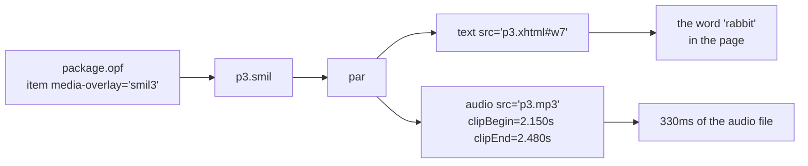
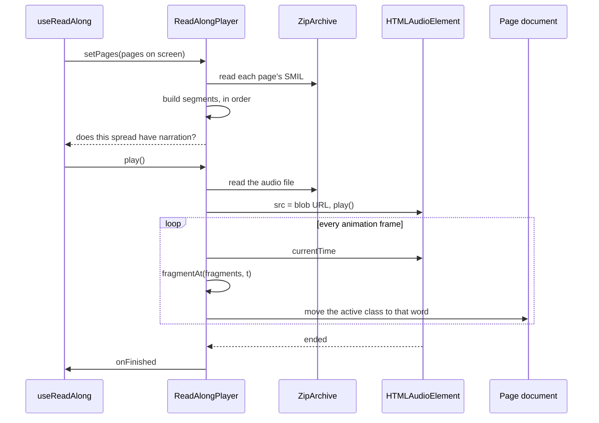
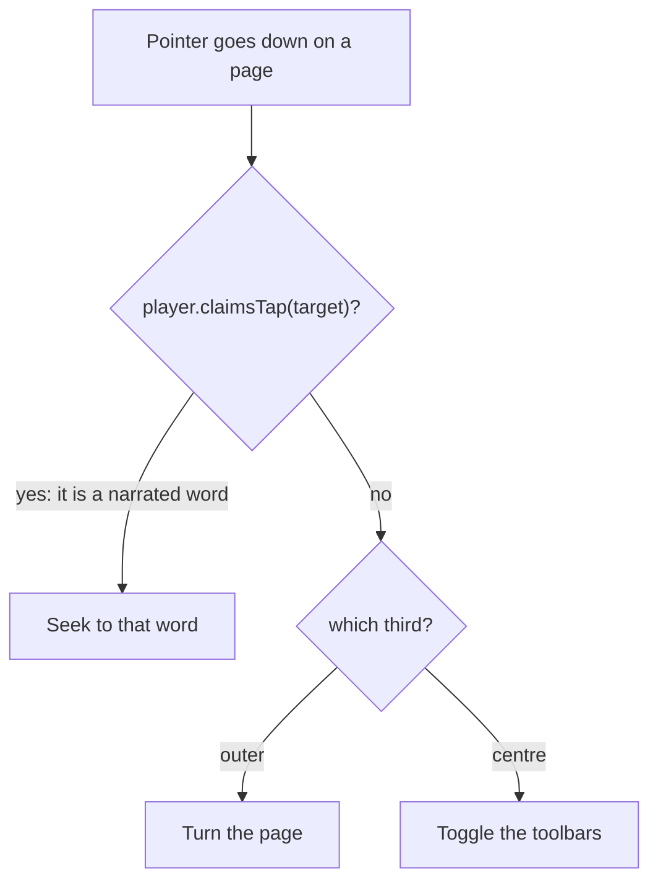
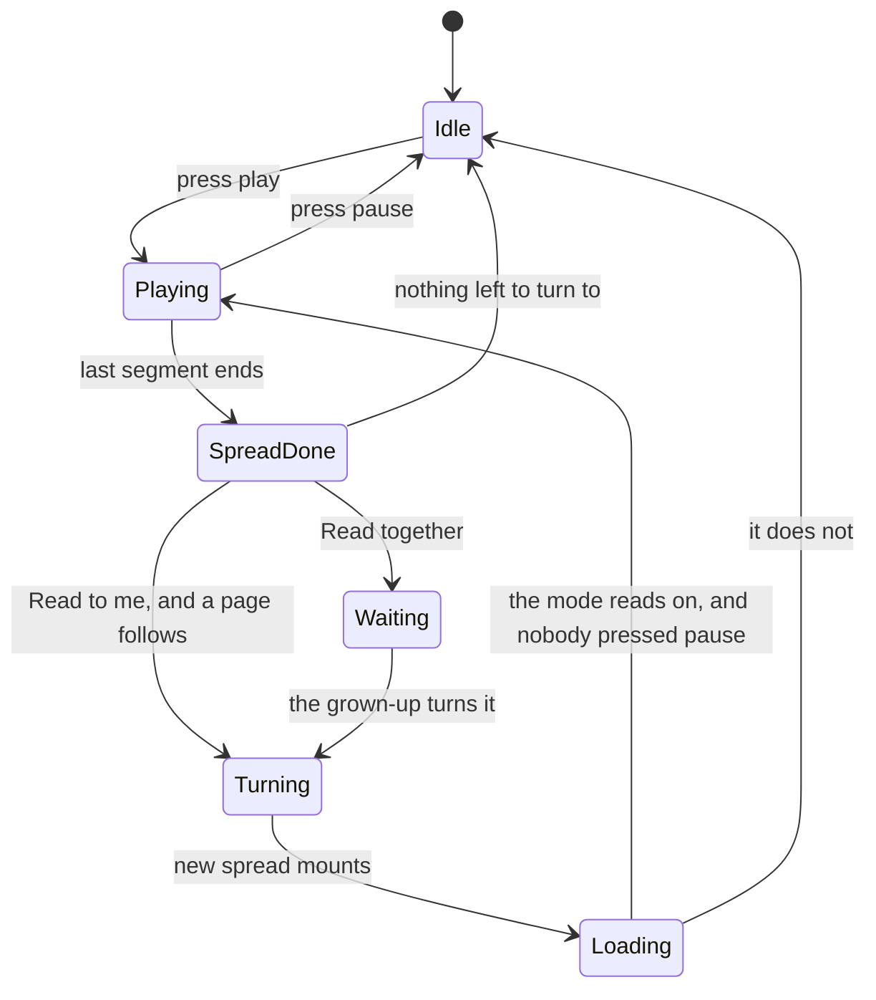
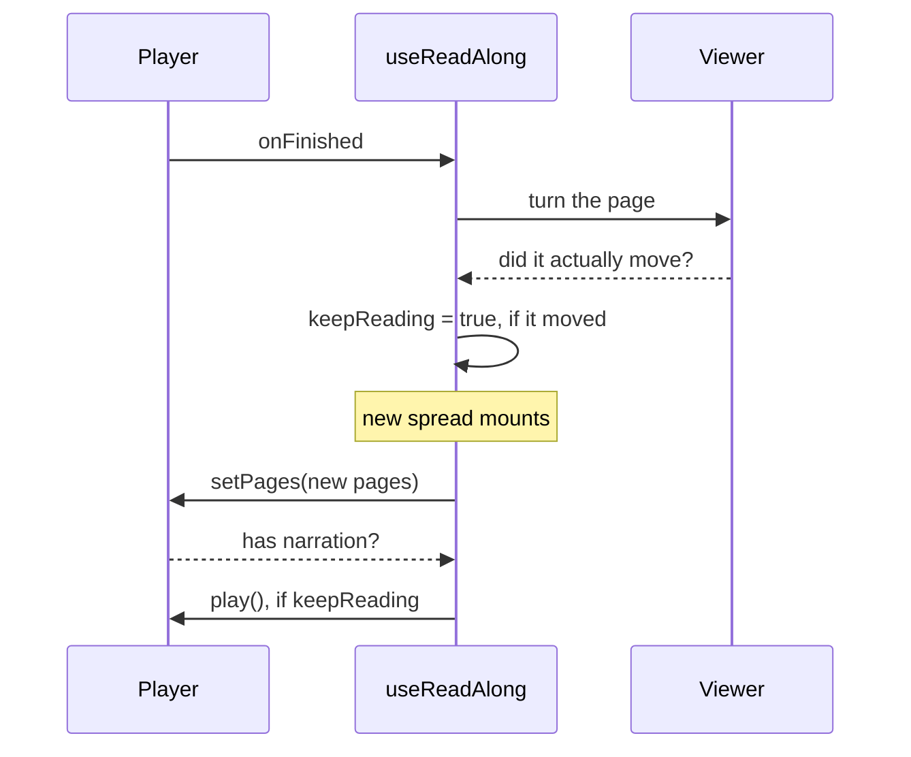

# Read-along

The book's own narration, with each word highlighted as it is spoken, and a tap on
any word to hear it from there. Almost no Android reader implements this, despite
the timing data shipping inside the books.

## Where the timings come from

EPUB 3 **Media Overlays**: a SMIL document per content document, tying fragments of
the page to clip ranges in an audio file.



In a real picture book that mapping is **per word**, which is what makes genuine
read-along possible. A page's SMIL is a sequence of `<par>` elements, each pairing
one element id with one clip range, in playback order.

```xml
<par id="p3s7">
  <text src="../p3.xhtml#w7"/>
  <audio src="../audio/p3.mp3" clipBegin="2.150s" clipEnd="2.480s"/>
</par>
```

`engine/overlays/smil.ts` flattens all of that into a list of `OverlayFragment`s —
container-absolute paths, an element id, and a start and end in seconds.

<details>
<summary><b>Advanced:</b> clock values are not just seconds</summary>

`parseClockValue()` handles the full SMIL 3.0 range, because real books use all of
it: `00:02:23.297` (full clock), `02:23.297` (partial), `23.297` (bare seconds),
plus timecounts — `300ms`, `12.5s`, `2.5min`, `1h` — optionally prefixed `npt=`.

A parser that only understood one form would not fail loudly; it would return
`undefined` for every fragment, the overlay would come back empty, and the book would
simply appear to have no narration. That silence is why the parser is thorough and
why `smil.test.ts` covers eleven cases of it.

Fragments with no `clipEnd`, or an end at or before the start, are dropped rather
than trusted — a zero-length fragment would make the highlight flicker on and
straight off again.
</details>

## Playing it



Two details in there are load-bearing.

**Audio is a blob URL, not a virtual-filesystem URL.** Media elements issue byte-range
requests constantly while playing and seeking. Answering each one through the service
worker and a `postMessage` round trip would be slow for no benefit, so the player
reads the audio out of the archive once and hands the element a blob.

**Highlighting is driven by `requestAnimationFrame`, not the `timeupdate` event.**
`timeupdate` fires roughly every 250ms. The shortest word in the reference book is
**62ms**. Driving highlighting from `timeupdate` would skip words outright — not
subtly late, simply never shown.

<details>
<summary><b>Advanced:</b> why a binary search runs every frame</summary>

`fragmentAt()` is a binary search over the fragment list, because it runs on every
animation frame — 60 times a second, against a list that can be hundreds of words
long. A linear scan would work and would also be wasteful in exactly the place where
waste shows up as jank.

It has one deliberate non-obvious behaviour. When the playhead falls *between*
fragments — a gap in the narration, a pause between sentences — it returns the
fragment just passed rather than "nothing". The highlight lingers on the last word
instead of flickering off and on again through every pause. `best = high` at the end
of the search is that rule.
</details>

## Tapping a word

A tap in the outer third of the page turns the page. A tap on a narrated word should
seek to it instead. Both are true at once, so the gesture layer asks the player
first.



<details>
<summary><b>Advanced:</b> the cross-realm bug that made this silently useless</summary>

Book pages live in iframes, and **every document has its own constructors**. A
`<span>` from inside an iframe is an instance of *that* document's `Element`, not the
parent's. So:

```ts
if (target instanceof Element) { ... }   // always false for a node from an iframe
```

This compiled, looked right, and made `claimsTap` return false for every word. Every
tap therefore fell through to the page-turn branch — and turning the page unmounted
the document before the click could seek, so the feature was unreachable on exactly
the books that have narration.

The fix is to duck-type instead: `node.nodeType === 1`. `asElement()` in
`reader/player.ts` does that, and `player.test.ts` pins it with a fake foreign node —
right shape, wrong constructor — because this is not the kind of bug you catch twice
by reading.

The same lesson applies anywhere the app reaches into a page document: pointer
forwarding, highlighting, anchors. If code crosses the iframe boundary, `instanceof`
is not available to it.
</details>

## Reading across a page turn

The part that is easy to get wrong: when narration reaches the end of a spread, the
page should turn and reading should continue.



Which branch `SpreadDone` takes is the reading mode (SPEC.md §7.3). *Read to me*
turns the page itself; *Read together* stops and brings the chrome back so the
control is already there; *Read myself* leaves `Loading` for `Idle`, so a page turn
ends the reading rather than carrying it on.

Note where `[*]` goes: to `Idle`, in every mode. Opening a book never narrates —
only `press play` leaves `Idle`.

`Waiting` is a state of the interface rather than of the player — the player is
simply idle — which is why the mode, not the player, decides whether the bars come
back.

The subtlety is that the player stops itself *before* announcing that it finished:

```ts
this.audio.pause()
this.setPlaying(false)      // listeners now see "not playing"
this.clearHighlight()
this.callbacks.onFinished() // ...and only then hear about it
```

So a handler that asks "were we playing?" to decide whether to resume always gets
`false`. `useReadAlong` therefore records the intention at the moment it still knows
it — a `keepReading` ref set inside `onFinished` — and the effect that runs when the
new spread mounts consults that ref rather than the player's state.



Note the question *"did it actually move?"*. `turn()` returns a boolean, false at
either end of the book. Without that, reaching the last spread would set
`keepReading` and the reader would sit there trying to resume narration that does not
exist.

<details>
<summary><b>Advanced:</b> the two endings, and why the fixture has both</summary>

There are two ways for narration to stop, and they need different behaviour:

1. **The end of a spread**, with more book to come — turn the page and carry on.
2. **The end of the narration**, with pages still to come — stop, and drop the
   read-along control, rather than hanging on a page with nothing to play.

A book narrated all the way through can only exercise the first. That is why
`corpus/fixtures/narrated-spreads.epub` narrates **five of its seven pages**: the
last spread is deliberately silent, so both endings are reachable in a test.

The audio in that fixture is generated rather than recorded — one tone per word,
pitched and faded so the clip boundaries in the SMIL fall on something audible
instead of on silence. A fixture that needed a real recording would be a fixture
nobody could regenerate, and every narrated book that exists is in copyright.

The UI audit drives that fixture end to end: press play, assert the reader reaches
the second spread with narration still running, then let it run out and assert the
control disappears. Before it existed, the auto-advance path was verified by hand and
by nothing else — which is how narration could stop dead at a page turn and no test
notice. It looks exactly like the end of the book unless you know how long the book
is.
</details>

## Settings

| Setting | Where |
|---|---|
| Speed: 0.75× / 1× / 1.25× | Reader menu |
| Automatic page turns | Reader menu |
| Highlight style | The book's own — `media:active-class` |

The highlight is **the publisher's**, not the app's. A book declares
`media:active-class` in its metadata and styles that class in its own stylesheet, so
the highlight looks the way the designer intended. `DEFAULT_ACTIVE_CLASS`
(`-epub-media-overlay-active`) is used only when a book omits it.
