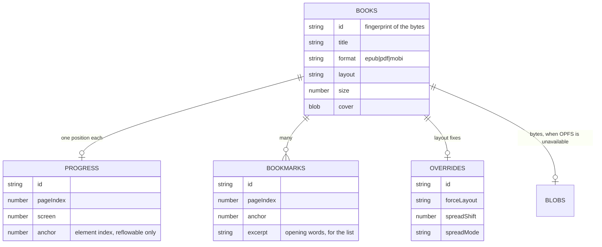
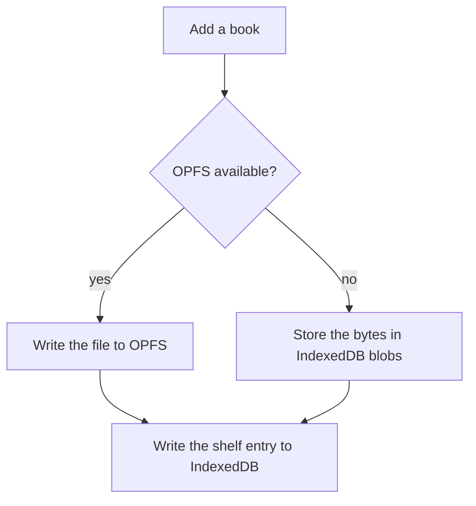
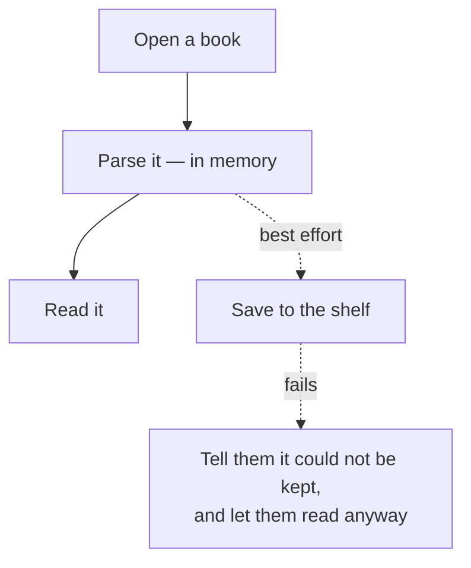
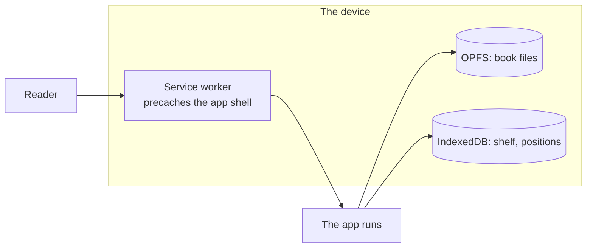

# Storage and offline

The reader never talks to a server at runtime. No accounts, no sync, no telemetry.
Everything is on the device, which makes "where does it go, and what if that fails?"
a design question rather than a detail.

## What is stored where

Two stores, with different jobs:

- **OPFS** (Origin Private File System) holds the book files themselves. It is built
  for large binaries and does not choke on a 60MB illustrated book.
- **IndexedDB** holds everything else — the shelf, positions, bookmarks, overrides —
  and the book bytes too when OPFS is not available.

<b>Advanced:</b> why not put everything in IndexedDB

It would work, and it is the fallback for exactly that reason. But OPFS is the better
home for the files:

- It is designed for large binaries, with streaming reads and no structured-clone
  step. IndexedDB round-trips a large `Blob` through its own serialisation.
- It keeps the *bytes* out of the store that holds the *metadata*. Listing the shelf
  should not touch 400MB of book data, and keeping them separate means a corrupt or
  evicted file cannot take the shelf entry with it.
- Quota accounting is clearer: the browser reports OPFS usage plainly, which is what
  the library screen shows.

The split does mean two things can disagree — a shelf entry whose file is gone. That
is handled rather than prevented; see below.

## When storage fails

It fails more often than you would think: private windows, a full device, a browser
that has evicted the origin, a WebView with storage disabled by policy.

The rule is **failing to save must never stop someone reading**.

So importing returns `persisted: false` rather than throwing, and the reader shows a
message explaining the book is open but was not kept. Position saving is the same:
best effort, and a failure to record where someone is does not interrupt the story.

<b>Advanced:</b> orphans, and pruning them honestly

Because the shelf and the files live in different stores, they can drift: the browser
evicts OPFS data while IndexedDB survives, and the shelf now lists books whose bytes
are gone. Tapping one would fail in a way that looks like a corrupt app.

`openStoredBook()` handles it at the point it becomes real. Listing the shelf does
not check every file — that would mean touching storage for every row on every
render — so a drifted entry stays visible until someone taps it. At that point, if
the file is gone, the row is deleted and the reader is told in plain words: the book
is no longer stored on this device, it has been removed from the shelf, add the file
again to read it.

Deleting it silently would leave a shelf entry that can never open, and a book
vanishing with no explanation looks like a bug in the app rather than what actually
happened, which is the browser reclaiming space.

The same reasoning governs the storage line on the library screen: the reader can see
how much room they are using, because "add a book" failing with no context is
exactly the situation where a number helps.

## Reading offline

The app is a PWA and the APK bundles the same build, so there is no network
dependency at runtime at all.

Airplane mode from a cold start is a supported case, and it is on the
[device test checklist](device-test.md). Inside the Capacitor shell the WebView
serves the bundle from the APK, so the first launch works offline too.

<b>Advanced:</b> updates, and not yanking a book away mid-story

A new deployment means a new service worker. The page has to reload to pick up the
new assets — but reloading mid-story would drop a child out of the book they are
reading, which is the worst possible moment.

So the reload is **deferred while a book is open**. `setReading(true)` in
`vfs/client.ts` arms that: if an update arrives during reading, it waits, and the
reload happens when they are back at the library.

There is a second failure this creates, and a control for it. A precached bundle can
serve stale assets for as long as the worker is not replaced, and there is no browser
control that forces the issue — a hard refresh does not help, because the worker
still controls the navigation and still answers with what it has. That is what the
version number on the library screen is for: pressing it unregisters every worker,
drops every Cache API entry, and reloads.

It deliberately leaves the library alone. The books live in OPFS and IndexedDB, and
throwing someone's shelf away to fix a stale bundle would be a terrible trade —
especially on a tablet where re-adding them means finding the files again.

## Feature detection, not assumption

Cheap Android tablets run old WebViews, and the reader is meant for exactly those.
Every capability it uses is detected, with a defined fallback:

| Capability | If missing |
|---|---|
| Service worker | `InlinePageResolver` renders pages via `srcdoc` — see [Opening a book](opening-a-book.md) |
| OPFS | Book bytes go to IndexedDB instead |
| Storage entirely | Read now, keep nothing, say so |
| Wake lock | The screen sleeps as it normally would |
| `:focus-visible` | Inside the supported baseline — Chromium WebView 100+, SPEC.md §5 |

<b>Advanced:</b> what "supported baseline" buys you

SPEC.md sets the floor at **Chromium WebView 100+** and Android 6 / API 23
(Capacitor 7's floor; `minSdkVersion` is 24). That line is what lets the code use
`:focus-visible`, modern CSS and OPFS without shims — a floor nobody writes down
becomes a floor nobody can rely on, and then every new API needs a polyfill debate.

Where a capability sits *above* that floor, it is detected rather than assumed. OPFS
is the clear case: available in the baseline on paper, genuinely absent in enough
real WebViews that the IndexedDB path is not theoretical.

Where a capability sits *below* the floor, it is used directly. `:focus-visible`
landed in Chromium 86, comfortably under 100, so the chrome auto-hide uses it with no
fallback — and `element.matches(':focus-visible')` would throw rather than return
false on a browser that did not know the selector, which is worth remembering if the
floor ever moves down.

